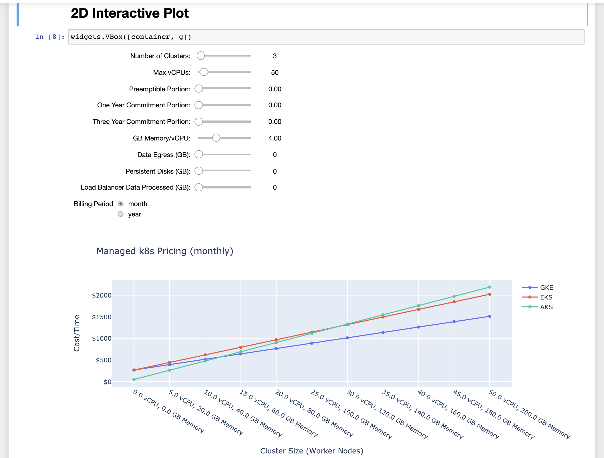

# managed-kubernetes-pricing

This notebook is meant to provide a mechanism to efficiently evaluate the price of running Kubernetes across the three major cloud providers:

 - Elastic Kubernetes Service (AWS)
 - Azure Kubernetes Service (Azure)
 - Google Kubernetes Engine (GCP)

I pulled the prices from each cloud providers pricing page, but if I made a mistake on any, feel free to let me know (via a github issue -- or even better a pull request!).

**TL;DR:** Azure doesn't charge for the compute used for the control plane, making AKS the cheapest for running many, smaller clusters. For running more, larger clusters GKE is the most affordable option. Also, running on spot/preemptible/low-priority nodes or long-term committed nodes makes a massive impact across all of the platforms.

*The End Result...*

